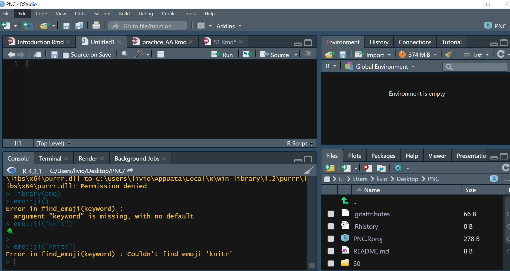

```{r setup, include=FALSE}
knitr::opts_chunk$set(echo = TRUE)
```

Today we will see how programming with `R` into an `Rmarkdown` file, and how to use its interface `Rstudio`. At some moment we will use `GitHub` to save our work.

# Let's start

## Use..`R`!

- **Reproducible analysis** (yes..again) `r knitr::include_graphics("Images/download.png")`

- **Free/open-source**

- **Continuously evolving and expanding**

- **Large community** `r knitr::include_graphics("Images/R-LadiesGlobal.png")`


## `RStudio`

```{r, echo = FALSE}

```

1. **SCRIPT**: Here you can write your `.R` and `.rmd` files. In the toolbar `r knitr::include_graphics("Images/toolbar.png")` you can save your script clicking on `r emo::ji("save")`.

2. **ENVIROMENT/HISTORY**: Here you can visualize your loaded **objects** (datasets etc) and see the code that you run.

3. **`R` CONSOLE**: Here your code is executed. You can:

   - directly write your code here and press`enter`,
   
   - write the code in the **SCRIPT** window and run it using `ctrl + enter` or using the `r knitr::include_graphics("Images/run.png")` button.

4. 
    - **FILES**: explores the local folders
    
    - **PLOTS**: where the plots come up
    
    - **PACKAGES**: where you can install packages
    
    - **HELP**: where you can see how a function is constructed. Alternatively you can use `?` before the function name, i.e., `?function`.

## Packages for everyone

`R` provides a number of **packages** that encapsulate very useful functions of various kinds. You can also create an `R` package!

We can install packages using the function `install.packages("name-of-the-package")`, e.g.,

```{r, eval = FALSE}
install.packages("ggplot2")
```

we install the `ggplot2` package, a very useful package to create amazing plots. After installing the package we need to invoke it in our session via the command `library("name-of-the-package")`, e.g.,

```{r, eval = FALSE}
library("ggplot2")
```

> for each thing you want to do there is a corresponding package! 

If you find this error in the future:

```{r, echo = FALSE}
print("Error in library(dplyr) : there is no package called dplyr")
```

means you need to install the `dplyr` package `r emo::ji("brightness")`.

> Tip: Errors/bugs search on Google or on  [stackoverflow](https://stackoverflow.com/)!


# Basics

## Arithmetic

- `+` for the **addition**

- `-` for the **subtraction**

- `*` for the **multiplication**

- `/` for the **division**


Some examples:

```{r}
3+5
```

```{r}
3-10
```

```{r}
4*pi
```

```{r}
20^(-1)
```

## Logical Comparison

- `>` stands for **GREATER**
- `<` stands for **LESS** 
- `==` stands for **EQUAL**
- `!=` stands for **NOT EQUAL**
- `>=` stands for **GREATER EQUAL**
- `<=` stands for **LESS EQUAL**
- `&` stands for **AND**
- `|` stands for **OR**

Some examples:

```{r}
4<10
```

```{r}
3>10
```

```{r}
(4<10)&(3>10)
```

```{r}
4==10
```

```{r}
8>=10
```

> Warning: The `=` and `<-` symbols are used to assign a value to an object. Different than `==` (logical operation defining equal).

As in all programming language `TRUE==1` and `FALSE==0`.

## Strings

The string is placed between two `"`, e.g.,

```{r}
"Let use R!"
```

## Objects

We can save some values into an object using the sign `=` or `<-`.

For example running:

```{r}
x <- 8
```

we assign the value $8$ to `x`. If we then call `x`, `R` will returns 8:

```{r}
x
```
- You can also assign a string to an object.
 
- You can make operations between objects:
 
```{r}
y <- 10
x*y
```
 
```{r}
z <- 2/3

x == z
```

The object can be: 

1. **logical**: `TRUE` or `FALSE`.

2. **integer**: a real number without a decimal part. 

3. **numeric**: pi, $0.55$, $1.98$, etc. i.e., a real number.

4. **character**: "hello", "I love stat", i.e., a string.

5. **factor**: "hello", "I love stat", i.e., a string (we will see the difference between factor and character later).

We can check it using the `class()` function:

```{r}
class(x)
```

## Vectors

We specify vectors using `c()`. Inside the `()` we put our values separated by **commas**. 

For example, running:

```{r}
x <- c(3, 20, 1)
```

creates an object `x` which is a vector having dimension equals $3$ with then three values $3$, $20$ and $1$.

We can make **arithmetic operations** between vectors, e.g.,

```{r}
x/3
```

or using functions:

- **Sum**

```{r}
sum(x)
```

- **Product**

```{r}
prod(x)
```

- **Absolute values**

```{r}
x <- c(-1,2,5)
abs(x)
```

- **Exponential**, i.e., `e^x`

```{r}
exp(x)
```

- **Natural logarithm** 

```{r}
x <- c(1,4,10)
log(x)
```
- **Maximum**

```{r}
max(x)
```

- **Minimum**

```{r}
min(x)
```

- **Range**

```{r}
range(x)
```

- **Mean**

```{r}
mean(x)
```

- **Median**

```{r}
median(x)
```

- **Variance**

```{r}
var(x)
```

- **Standard deviation**

```{r}
sd(x)
```

We can also use some specific **functions** to create vector directly if its values have a specific pattern:

```{r}
1:10 #Here we create a vector with integer values from 1 to 10
```


```{r}
seq(1,10) #Here we create a sequence with integer values from 1 to 10
```

```{r}
seq(1,10,by = 2) #Here we create a sequence with integer values from 1 to 10 with an increment equals 2
```

```{r}
seq(1,10,length.out = 3) #Here we create a sequence taking values in [1,10] having length equals 3.
```

Other useful functions:

- Vector **length**:

```{r}
length(x)
```

- **Repeat** a vector:

```{r}
rep(x,3) #Here we repeat the vector x three times
```

- Using **random values** generated from some distribution:

  1. `rnorm()` Normal distribution
  
  2. `runif()` Uniform distribution
  
  3. `rpois()` Poisson distribution
  
  4. `rgamma()` Gamma distribution
  
  5. `rt()` Gamma distribution
  
For example:

```{r}
rnorm(n = 5, mean = 2, sd = 1.5) #Here we genereted 5 values from a Normal distribution with mean 2 and standard deviation 1.5.
```

For a complete look of the distributions available on R, see `help(Distributions)`.

We can also extract a part of the vector using the square brackets `[]`:

1. by **numerical indices**:

```{r}
x[c(1, 3)] #Here we extract the first and third elements
```

2. by **logical indices**:

```{r}
x[c(TRUE, FALSE, TRUE)] #Here we extract the first and third elements
```
Note that the object inside the square brackets is a vector, with length equals the number of elements of the vector that we want to extract if we use **numerical indices**, or with length equals the lengths of the vector if **logical indices** are used. Here, you can use also the `seq()`, `rep()`, `:` functions. Finally, you can create the logical indices using some logical comparison, e.g., 

```{r}
x[x>4] #Here we extract the elements of x having value greater than 4.
```
We can use the square brackets also for **changing** one or more values of the vector:

```{r}
x[1] <- 6 #Here we substitute the first element of the vector with 6.
x
```


## Matrices

Matrices are a **two-dimensional data structure**, where elements are arranged according to rows and columns. We can think the matrix as a collection of vectors.

We can create a matrix using the function `matrix()`:

:::: {style="display: grid; grid-template-columns: 1fr 21fr; grid-column-gap: 2px; place-items: start; padding: 2em 2em 2em 2em; border: 5px solid #f8f8f8;"}

::: {}

```{r, echo=1:15}
X <- matrix(data = c(1:20), nrow = 4, ncol = 5, byrow = TRUE)
```
:::

::: {}

* `data`: vector of values used to fill the matrix.

* `nrow`: the desired number of rows.

* `ncol`: the desired number of columns.

* `byrow`: logical value. If FALSE (the default) the matrix is filled by columns, otherwise the matrix is filled by rows.

:::
::::

We can also fill the matrix with strings.

As in the case of vectors, we can extract a subset of the matrix using the quare brackets `[]`. Here, the indices must be **two-dimensional**: one dimension for extracting the rows, and one dimension for extracting the columns.

```{r}
X[1:2, 4] #Here we extract the first and second rows and the fourth column. So two values
```
Also, here we can use logical indices instead of numerical ones or logical comparisons. If you want to select only one dimension, you must put nothing in the other dimension of the square brackets:

```{r}
X[1:2,] #Here we extract the first and second rows and all the columns. So ten values
```
```{r}
X[,1:2] #Here we extract the first and second columns and all the rows So ten values
```

> The selection operation does not change the initial object. Therefore, it is necessary to save the result of the selection if you want to keep the changes. (This is valid also working with vectors).

Other useful functions:

- Matrix **dimension**:

```{r}
dim(X)
```

- Number of **columns**:

```{r}
ncol(X)
```

- Number of **rows**:

```{r}
nrow(X)
```

- **Combine** two or more matrices by columns (matrices must have the same number of rows):

```{r}
Y <- matrix(data = seq(from = 20, to =60, length.out = 5*4), nrow = 4, ncol = 5, byrow = TRUE)
cbind(X, Y)
```
- **Combine** two or more matrices by rows (matrices must have the same number of columns):

```{r}
rbind(X, Y)
```

- **Transpose**, i.e., $X^\top$:

```{r}
t(X)
```

- **Product** between matrices:

```{r}
t(X) %*% Y
```

- **Inverse** of a matrix, i.e. $Z^{-1}$:

```{r}
Z <- matrix(rnorm(5*5), nrow = 5)
solve(Z)
```

- Extract the **diagonal ** of a matrix:

```{r}
diag(Z)
```

- **Determinant** of matrix:

```{r}
det(Z)
```

> Using `+`, `-`, `*`, `/` between two matrices perform the element-wise operations.

## Array

We can create objects that have more than two dimensions, i.e., an array. We use the `array()` command by indicating the vector of values used to populate the object and the size of each of its dimensions:

:::: {style="display: grid; grid-template-columns: 1fr 21fr; grid-column-gap: 2px; place-items: start; padding: 2em 2em 2em 2em; border: 5px solid #f8f8f8;"}

::: {}

```{r, echo=1:15}
X <- array(data = rnorm(2*3*5), dim = c(2,3,5))
```
:::

::: {}

* `data`: vector of values used to fill the matrix.

* `dim`: the dimensions for the array to be created, that is an integer vector of length one or more giving the maximal indices in each dimension.

:::
::::

All the main functions and selection operations we have seen for arrays and vectors can be performed similarly with arrays. We can check the dimensions of the array using the `dim()` command.

## Dataframe

Dataframes are one of the most commonly used objects in `R` to represent data. These objects are two-dimensional as matrices, but they can contain every types of data (e.g., strings and numbers). We can think about dataframes as normal tables from Excel etc.


:::: {style="display: grid; grid-template-columns: 1fr 21fr; grid-column-gap: 2px; place-items: start; padding: 2em 2em 2em 2em; border: 5px solid #f8f8f8;"}
::: {}
```{r}
x_num <- rnorm(9, mean = 5)
y_string <- rep(c("ciao", "hello", "hola"),3)
db <- data.frame(Numbers = x_num, 
                 Strings = y_string, row.names = NULL, stringsAsFactors = TRUE)
```
:::
::: {}
* ... = We must specify each column with its column name.

* row.names = `NULL` or a single integer or character string specifying a column to be used as row names, or a character or integer vector giving the row names for the data frame.

* stringsAsFactors = logical: should character vectors be converted to factors?
:::
::::

We can select the elements of a dataframe in two ways:

- select a column with the sign `$` and then the element of the column:

```{r}
db$Numbers[c(4,8)]
```

- select the columns and the rows using directly the square brackets `[]`:

```{r}
db[c(4,8), 1]
```
We can see the column names using the `colnames` command:

```{r}
colnames(db)
```
and change them:

```{r}
colnames(db) <- c("Col1", "Col2")
```

The same for the rows using the command `rownames` command.

## List

Lists are one of the most versatile and useful objects in `R`. The list can contain different types of objects as the dataframe but also having different dimensions since the elements of a list are completely indipendent.

We create a list with the `list()` command:

```{r}
my_first_list <- list(my_array = X,
                      my_data_frame = db,
                      my_vector = x)
```

and we can call an object of this list 

- using `$` 

```{r}
my_first_list$my_data_frame[1,2]
```


- using `[[]]` 

```{r}
my_first_list[[2]][1,2]
```
Since we have extracted an object from the list, all the things we have seen for vectors, matrices, dataframes etc can be applied directly.


## Concluding 

We can check the structure of our object (vector, matrix, array, dataframe) and its class using the `str()` function:

```{r}
str(X)
```
or check it using the functions `is.vector()`, `is.matrix()`, `is.array()` and `is.data.frame()`:

```{r}
is.matrix(X)
```

The `summary()` command shows us the structure of the object:

```{r}
summary(X)
```


```{r}
summary(db)
```

and the functions `head()`/`tail()` returns the first/last parts of a vector, matrix, table, data frame or function:

```{r}
head(db)
```

```{r}
tail(db)
```

# Other fundamental functions

- Help?

```{r, eval = FALSE}
help("+") #Looking for help in understanding the use of +
```

- Where I am and where I want to go

```{r, eval = FALSE}
setwd("my_path") #Set Working Directory
getwd() #Get Working Directory
```

- See what is in my working directory?

```{r}
ls() #return a vector of character strings giving the names of the objects in the specified environment.
```

- Save what we found in the working directory or a particular object?

- Delete what we found in the working directory or a particular object?

```{r, eval = FALSE}
rm(list = ls()) #Deltere everything in my working directory
rm(x) #Delete x
```

# Load data

How to upload data? Depends... 

First see the format of your document (`.xlsx`, `.csv`, `.xls`, `.txt` etc), in general, there will be a corresponding command:

- `read.table()`: Reads a delimited (space, tab, comma) data file.

- `read.csv()`: Reads a `.csv` file.

- `read_excel()`: Reads a `.xlsx` file. You must install the package `readxl`.

Inside the parenthesis you must specify the path where the file is and some other options $\rightarrow$ check these options using the help function.

For example:

```{r, eval = FALSE}
help("read.table")
```

Alternatively you can use the toolbar:

`Files > Import Datasets >`

# Basic Tidyverse Concepts

The `tidyverse` is not really a package, but a collection of packages. Let install it and load it in our working directory:

```{r, eval = FALSE}
install.packages("tidyverse")
```

```{r}
library(tidyverse)
```

`Tidyverse` is based on the **pipe operator** i.e.,`%>%`. It connects two function calls by making the value returned by the first call the first argument of the second call:

```{r}
c(1:3) %>% rep(3) 
```
returns the same output as

```{r}
rep(c(1:3), 3)
```

We can use the pipe more than one times:

```{r}
c(1:3) %>% rep(3) %>% length()
```

By default the value of the left-hand call is piped into the right-hand call as the first argument. You can make it some other argument by referring to it as the dot `.`, for example:

```{r}
3 %>% rep(c(1:3), .) 
```

## `dplyr`

Inside the `tidyverse` function we have the useful `dplyr` package. We will see only the main functions of this package, but you can use the basic `R` command proposed before instead of these ones. 

- `filter()`: Subset **rows** using column values

- `select()`: Subset **columns** using their names and types

- `mutate()`: Create, modify, and delete **columns**

- `group_by()`: **Group** by one or more variables

- `summarize()`: Summarise each group to **fewer rows**

Let see some examples. First of all, we load the `R` dataset `ChickWeight` from the package `datasets`


```{r}
library(datasets)
data("ChickWeight")
```

You can see the description of this dataset typing `help(ChickWeight)`. So, we want:

- select only the weight and chick columns:

```{r}
ChickWeight %>% select(weight, Chick) %>% head()
```

- and compute the mean of the weight for each chick:

```{r}
ChickWeight %>% select(weight, Chick) %>%
  group_by(Chick) %>%
  summarize(weight = mean(weight, na.omit = TRUE))
```

- filter only the chick with weight greater than the global mean

```{r}
ChickWeight %>% select(weight, Chick) %>%
  group_by(Chick) %>%
  summarize(weight = mean(weight, na.omit = TRUE)) %>%
  filter(weight >= mean(weight))
```

> Why did we look at the `dplyr` package if we could directly use the basic functions in `R`? We will use another useful and famous `R` package which follows a similar structure $\rightarrow$ `ggplot2`!

We will use the `ggplot2` package for our last lesson, i.e., **EXPLORATORY DATA ANALYSIS**.

# Ok all good, but what if I want to analyze eeg data, fmri etc?

The [Neuroconductor Project](https://neuroconductor.org/) is a large repository of `R` packages for imaging. It includes $86$ packages published on CRAN! You can find the complete list with all the documentations [here](https://neuroconductor.org/list-packages/all).

Some of my favorites:

- `fmri`: perform an fMRI analysis as described in [Tabelow et al. (2006)](10.1016/j.neuroimage.2006.06.029), [Polzehl et al. (2010)](10.1016/j.neuroimage.2010.04.241), and [Tabelow and Polzehl (2011)](10.18637/jss.v044.i11).

- `eegUtils`: EEG processing and visualization tools.

- `RNifti`: Provides very fast read and write access to images stored in the NIfTI-1, NIfTI-2 and ANALYZE-7.5 formats.

and there are other packages not on CRAN, like:

- `eeguana`: flexible manipulation of EEG data with `dplyr`-like functions. You must install it using `devtools::install_github("bnicenboim/eeguana")`. Note that we load the package `devtools` directly using `::`.

# Some references:

- [R cookbook](https://rc2e.com/)

- [The Tidyverse cookbook](https://rstudio-education.github.io/tidyverse-cookbook/)


