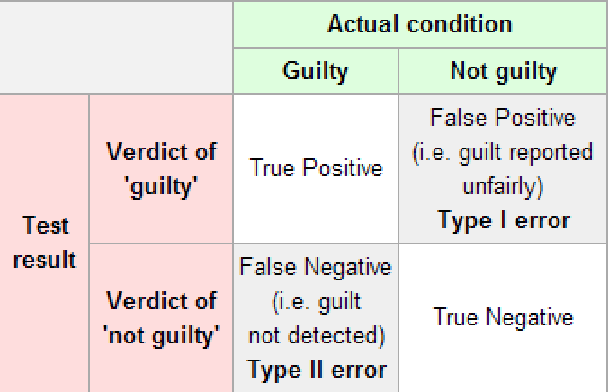
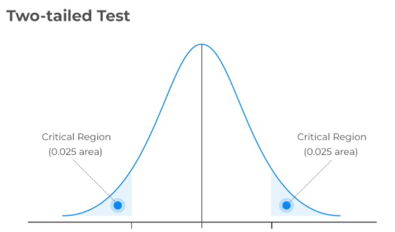

```{r setup, include=FALSE}
knitr::opts_chunk$set(echo = TRUE, warning = FALSE, message = FALSE, fig.align = "center")
```

```{r}
library(tidyverse)
load("../S4/data/db_full.RData")
```


# Introduction

So, in the previous lesson we understand two type of inferences:

1. **Point estimate**: How to attempt to guess the value of an unknown parameter? 

2. **Confidence interval**: How to determine, for an unknown parameter, a interval that contains its true value *with high probability*?

and now, we will see another one: **Hypothesis testing**. The idea is simple: **the researcher has some theory about the world, and wants to determine whether or not the data actually support that theory.**

In other words:

3. **Hypothesis testing**: How to proceed to the acceptance or rejection of a particular hypothesis made about an unknown parameter?

Considering our data, we would be interest in answering the following question:

> Is the average AHI total score in adults in Australia is different than the European mean (70)?


From this question, we can establish the concepts of the **null** and **alternative hypotheses**. This is where things may become somewhat counterintuitive for many individuals. What I'm about to do is create a new statistical hypothesis (referred to as the **null hypothesis**, $H_0$), which corresponds to the exact opposite of what I want to believe. I will then primarily focus on this null hypothesis, almost to the exclusion of what I'm genuinely interested in, which we now call the **alternative hypothesis**, $H_1$ (or $H_a$).

So, we utilize data from a sample to make a decision between two competing hypotheses regarding a population. We make these hypotheses more specific by expressing them in terms of at least one population parameter of interest. These competing assertions about the population are ours null and alternative hypothesis. In other words: 

- The hypothesis for which we aim to find significant evidence is ascribed to the **alternative hypothesis**. Typically, the alternative hypothesis is what the experimenter or researcher seeks to establish or find evidence for.

- In many cases, the **null hypothesis** is a statement suggesting that there is, in fact, *no effect* or *no difference*. Often, the null hypothesis represents the existing state of affairs or the idea that nothing remarkable is occurring.

We then evaluate the strength of evidence by **assuming that the null hypothesis is true** and determining how **improbable** it would be to observe sample results or statistics as extreme as, or more extreme than, those in the original sample.

considering our example, $H_0: \theta \le 70$ and $H_1: \theta > 70$.

In essence, what we're doing here is dividing the possible values of $\theta$ into two categories: 

1. those values that I sincerely hope are not true (the null), and 

2. those values that I would be content with if they turn out to be accurate (the alternative). 

Having done that, it's essential to recognize that the objective of a hypothesis test is **not to demonstrate that the alternative hypothesis is (probably) true; the goal is to demonstrate that the null hypothesis is (probably) false**.

Let's consider again $X \sim f(x; \theta)$ where $\theta \in \Theta$, the statistical test wants to find a partition of the parametric space $\Theta = \{\Theta_0, \Theta_1\}$ such that:

$$
H_0: \theta \in \Theta_0 \quad\quad H_1: \theta \in \Theta_1
$$

You can draw an analogy with what happens in a courtroom, when a jury must decide on the guilt or innocence of a defendant.

* **The null hypothesis**: the defendant is innocent (lack of an effect).
* **The alternative hypothesis**: the defendant is guilty.
* The jury considers the defendant innocent unless the accuser presents **strong evidence** in favor of their guilt.

In this case, we ensure that we almost never convict an innocent person (**Type I error**), which is a much more serious mistake than acquitting a guilty person (referred to as a **Type II error**). So, now we already know the concepts of Type I and II error:

```{r, echo = FALSE, fig.align="center"}

```

If we reject a null hypothesis that is actually true, then we have made a **Type I error**. On the other hand, if we retain the null hypothesis when it is in fact false, then we have made a **Type II error**. In general:


|             | retain $H_0$                                 | reject $H_0$                 |
|-------------|----------------------------------------------|------------------------------|
| $H_0$ true  | $1- \alpha$ (probability of correct retention) | $\alpha$ (type I error)        |
| $H_0$ false | $\beta$ (type II error)                        | $1- \beta$ (power of the test) |

The single most important design principle of the test is to **control the probability of a Type I error**, to keep it below some fixed probability. This probability, which is denoted $\alpha$, is called the **significance level** of the test. A hypothesis test is said to have significance level $\alpha$ if the type I error rate is no larger than $\alpha$.

So, what about the **Type II error rate**? Well, we would also like to keep those under control too, and we denote this probability by $\beta$. However, it's much more common to refer to the power of the test, which is the probability with which we reject a null hypothesis when it really is false, which is $1-\beta$.


A *powerful* hypothesis test is one that has a small value of $\beta$, while still keeping $\alpha$ fixed at some (small) desired level. By convention, scientists make use of three different $\alpha$ levels: $0.05$, $0.01$, $0.001$.

At this point we need to start talking specifics about how a hypothesis test is constructed. To that end, let's return to the AHI example. We have our sample, and we can compute the sample mean of AHI total scores, which equals to `r round(mean(db_full$ahiTotal),3)`. After looking at the value of our sample mean, we make a decision about whether to believe that the null hypothesis is correct, or to reject the null hypothesis in favor of the alternative. The name for this thing that we calculate to guide our choices is a **test statistic**.

Having chosen a test statistic, the next step is to state precisely which values of the test statistic would cause is to reject the null hypothesis, and which values would cause us to keep it. In order to do so, we need to determine what the **sampling distribution of the test statistic would be if the null hypothesis were actually true**. 

Why do we need this? 

Because this distribution tells us exactly what values of our null hypothesis would lead us to expect. And therefore, we can use this distribution as a tool for assessing how closely the null hypothesis agrees with our data.

How do we actually determine the sampling distribution of the test statistic? 

Our population parameter $\theta$ is just the population mean, and our test statistic is the sample mean which we know the distribution from last week lesson:

$$\bar{X}_n \sim \mathcal{N}(\mu, \sigma^2/n)$$

Since the null hypothesis states that $\mu = 70$, we have the sampling distribution under the null hypothesis $H_0$ we need:

$$\bar{X}_n \sim_{H_0} \mathcal{N}(70, \sigma^2/n)$$
As in the last lesson, here we have two situations:

- $\sigma^2$ known
- $\sigma^2$ unknown

In the second case, we use the estimator $S^2/n$ for $\sigma^2/n$.

Therefore, having the sampling distribution under $H_0$, we must understand if the value observed in our sample reject or not the null hypothesis. Is it `r round(mean(db_full$ahiTotal),3)` a probable value considering the distribution under the null hypothesis?  What decision should I make? Should I choose to believe the null hypothesis, or the alternative hypothesis?
  
Let's represent the distribution of the test statistic $\bar{X}_n$ under $H_0$ and the sample mean by a red dotted line:  
  
```{r}

ggplot()+
  geom_density(aes(x = rnorm(1000, 
                             mean = 70, 
                             sd = sd(db_full$ahiTotal)/sqrt(nrow(db_full)))))+
  geom_vline(aes(xintercept = mean(db_full$ahiTotal)), col = "red", linetype = "dotted", size = 1)+
  theme_minimal() +
  xlab(expression(bar(X)[H[0]]))
```
  
By using the distribution of the test statistic, it's possible to identify a range of values for that statistic that are unlikely to occur if the null hypothesis is true. The distribution of the test statistic is divided into two regions:

1. **A critical region**, which consists of the values of a test statistic that lead to the rejection of the null hypothesis.
2. **An acceptance region**, which comprises the values of a test statistic that result in the acceptance of the null hypothesis.

The critical region corresponds to those values of the test statistic for which we would reject the null hypothesis. Now, let's suppose that we chose a critical region that covers $5\%$ of the sampling distribution, and suppose that the null hypothesis is actually true. What would be the probability of incorrectly rejecting the null? The answer is of course $5\%$. And therefore, we would have built a test that had an $\alpha$ level of $0.05$. If we want $\alpha = 0.05$, the critical region is only allowed to cover $5\%$ of the sampling distribution of our test statistic.

An example of critical regions considering $\alpha = 0.05$:

```{r, echo = FALSE, fig.align="center"}

```


As you can note our critical region consists of the **most extreme values**, known as the tails of the distribution. As it turns out, if we want $\alpha = 0.05$, then our critical regions correspond to the right part of the quantile of the sampling distribution at level $1-\alpha$ plus the left part of the quantile of the sampling distribution, i.e., 

```{r}
alpha <- 0.05
quantiles <- qnorm(c(alpha/2, 1- alpha/2), 
      mean = 70, 
      sd = sd(db_full$ahiTotal)/sqrt(nrow(db_full)))
quantiles
```

Let's add these values on our previous plot:

```{r}
ggplot()+
  geom_density(aes(x = rnorm(1000, 
                             mean = 70, 
                             sd = sd(db_full$ahiTotal)/sqrt(nrow(db_full)))))+
  geom_vline(aes(xintercept = mean(db_full$ahiTotal)), col = "red", linetype = "dotted", size = 1)+
  theme_minimal() +
  xlab(expression(bar(X)[H[0]]))+
  geom_vline(aes(xintercept = quantiles[1]), col = "blue", linetype = "dashed", size = 1)+
  geom_vline(aes(xintercept = quantiles[2]), col = "blue", linetype = "dashed", size = 1)

```

The area left to `r round(quantiles[1],3)` equals $0.025$ and its our left critical region, in the same way the area right to `r round(quantiles[2],3)` equals $0.025$ and it our right critical region. We can note that our statistic (sample mean) falls into the right critical region, so we reject the null hypothesis.

To sum up:

1. We choose an $\alpha$ level

2. Come up with some test statistic that does a good job (in some meaningful sense) of comparing $H_0$ and $H_1$

3. figure out the sampling distribution of the test statistic on the assumption that the null hypothesis is true (in this case, normal) and then 

4. calculate the critical region that produces an appropriate $\alpha$ level  
 
In *alternative* you can compute the famous $p$-value `r emo::ji("boom")` `r emo::ji("boom")` `r emo::ji("boom")`. We noted before that when we constructed the critical region, it corresponded to the tails (i.e., extreme values) of the sampling distribution. That's not a coincidence: almost all *good* tests have this characteristic (good in the sense of minimizing our type II error rate, $\beta$). **The reason for that is that a good critical region almost always corresponds to those values of the test statistic that are least likely to be observed if the null hypothesis is true**. If this rule is true, then we can define the $p$-value: 

**as the probability that we would have observed a test statistic that is at least as extreme as the one we actually did get. In other words, if the data are extremely implausible according to the null hypothesis, then the null hypothesis is probably wrong.**

In our case:

```{r}
pnorm(mean(db_full$ahiTotal), 
      mean = 70, 
      sd = sd(db_full$ahiTotal)/sqrt(nrow(db_full)), 
      lower.tail = FALSE)
```
The p-value is very very small, i.e., it is the right area from the sample mean (dotted red line represented before). $\rightarrow$ we reject $H_0$!


There's one more thing we must point out about hypothesis testing. Right now, we analyze the alternative hypothesis covers both the possibility that $\mu < 70$ and the possibility that $\mu > 70$. This is called  **two-sided** test, i.e., the alternative hypothesis covers the area on both *sides* of the null hypothesis, and as a consequence the critical region of the test covers both tails of the sampling distribution ($2.5\%$ on either side if $\alpha = 0.05$).

However, that's not the only possibility. It might be the case, for example, that I'm only willing to believe in AHI scores of the Italian adults greater than the European target ($70$). If so, then my alternative hypothesis would only covers the possibility that $\mu > 70$, and as a consequence the null hypothesis now becomes $\mu \le 70$.
 
When this happens, we have what's called a **one-sided test**, and when this happens the critical region only covers one tail of the sampling distribution.

To sum up:

1. **Two-sided** hypothesis testing: $H_0: \mu = \mu_0$ versus $H_0: \mu \ne \mu_0$ 
1. **One-sided** hypothesis testing: $H_0: \mu \ge \mu_0$ versus $H_0: \mu < \mu_0$, $H_0: \mu \le \mu_0$ versus $H_0: \mu > \mu_0$

> The choice of the hypothesis testing depends on the research question!

Let's now see the **good** statistical tests considering different research questions.

# Mean ($\mu$)

Our research question was:

> Is the average AHI total score in adults in Australia is different than the European mean (70)?

We already saw that $\bar{X}_n \sim \mathcal{N}(\mu, \sigma^2/n)$ if $X \sim \mathcal{N}(\mu, \sigma^2)$, and $\bar{X}_n \approx \mathcal{N}(\mu, \sigma^2/n)$ if $X \sim f(x, \theta)$.

Therefore, under the null hypothesis we have: 

$$
T = \dfrac{\bar{X}_n - \mu_0}{\sigma^2/n} \sim \mathcal{N}(0,1) \quad \text{or approximate}
$$

where $\mu_0$ is the value of $\mu$ under $H_0$.

Let consider our data, we will have an estimate of $T$, $t_{\text{oss}}$. We must understand now if $t_{\text{oss}}$ is inside the rejection region. 

Since $T \sim \mathcal{N}(0,1)$, we can use the quantile of a standard normal distribution as critical values at level $\alpha/2$ and $1-\alpha/2$.

However, we already saw that generally $\sigma^2$ is not known. So, we must use $S^2$ instead, and then $T$ is now distributed as a t-student with again $n-1$ degree of freedom.

## In `R`

To compute the statistical test for the mean we can use the function  `t.test`

```{r}
t.test(db_full$ahiTotal, mu = 70)
```

that automatically considers the Student's t-distribution. In the argument `mu` we can specify the value under the null hypothesis (in our case `70`). By default,  `R` considers $\mu_0 = 0$.

We can note that the p-value is really small (we computed it before!), therefore the probability that we would have observed a test statistic that is at least as extreme as the one we actually did get under the null hypothesis is really small.

We can also understand if we can reject $H_0$ computing the critical values that define the rejections region:

We can see the value of the test statistic in `t`. We can compute the quantiles:

```{r}
alpha = 0.05
quantiles_t = qt(c(alpha/2, 1-alpha/2), df =nrow(db_full)-1)
quantiles_t
```

and see that our test is in the rejection region:

```{r}
ggplot()+
  geom_density(aes(x = rt(1000, df = nrow(db_full)-1)))+
  geom_vline(aes(xintercept = quantiles_t[1]), linetype = "dashed", col = "blue", size = 1)+
  geom_vline(aes(xintercept = quantiles_t[2]), linetype = "dashed", col = "blue", size = 1)+
  geom_vline(aes(xintercept = t.test(db_full$ahiTotal, mu = 70)$statistic), col = "red", linetype = "dotted", size = 1)+
  theme_classic() + xlab(expression(T))
```

What if I have these hypotheses $H_0: \mu \ge 70$, $H_1: \mu \le 70$?


```{r}
t.test(db_full$ahiTotal, mu = 70,alternative = "less")
```

You can note that the observed statistical test is the same, but the p-value now is equal to $1$.


```{r}
ggplot()+
  geom_density(aes(x = rt(1000, df = nrow(db_full)-1)))+
  geom_vline(aes(xintercept = qt(alpha, df = nrow(db_full)-1)), linetype = "dashed", size = 1, col = "blue")+
  geom_vline(aes(xintercept = t.test(db_full$ahiTotal, mu = 70)$statistic), col = "red", linetype = "dotted", size = 1)+
  theme_minimal()+
  xlab(expression(T))
```

# Proportion ($\pi$)

Another research question could be:

> Considering the Austrial adults with AHI total scores $\ge$ than the European mean 70, we have more females?

We already saw that here we are analyzing the population proportion $\pi$, and 

$$\bar{X}_n = \hat{\pi} \approx \mathcal{N}(\pi, \pi (1-\pi)/n)$$

Therefore, under the null hypothesis $H_0: \pi \le \pi_0$ we have:

$$T = \dfrac{\hat{\pi} - \pi_0}{\sqrt{\pi_0 (1-\pi_0)/n}} \approx \mathcal{N}(0,1)$$

## In `R`

To compute the statistical test for $\pi$ we can use the function  `prop.test`

```{r}
prop.test(table(db_full$sex[db_full$ahiTotal >= 70]), alternative = "greater")
```
> What we can say?

> Let's try to compute the sampling distribution ans so on as we saw in the case of hypothesis testing for $\mu$!

# Difference in means ($\mu_1 - \mu_2$)

Another research question could be:

> Is the average difference of AHI total score between females and males different?


We saw in the previous lessons that this means making inference on the mean difference $\bar{X}_1 - \bar{X}_2$. Its sampling distribution equals:

  - $\bar{X}_1 - \bar{X}_2 \sim \mathcal{N}(\mu_1 -\mu_2, \sigma^2_{\bar{X}_1 - \bar{X}_2})$ if $X_1 \sim \mathcal{N}(\mu_1, \sigma^2_1)$ and  $X_2 \sim \mathcal{N}(\mu_2, \sigma^2_2)$

  - $\bar{X}_1 - \bar{X}_2 \approx \mathcal{N}(\mu_1 -\mu_2, \sigma^2_{\bar{X}_1 - \bar{X}_2})$ if $n_1$ and $n_2$ sufficiently large.

Where $\sigma^2_{\bar{X}_1 - \bar{X}_2}$ is the variance of the point estimator $\bar{X}_1 - \bar{X}_2$, which describes its sampling variability.

Again, we don't know $\sigma^2_{\bar{X}_1 - \bar{X}_2}$ and we must estimate it in some way. Here, there are two possibilities:

- Assuming $\sigma^2_1 = \sigma^2_2$: $\quad \sigma^2_{\bar{X}_1 - \bar{X}_2} = \dfrac{\sigma^2_1}{n_1} + \dfrac{\sigma^2_2}{n_2}$
- Assuming $\sigma^2_1 \ne \sigma^2_2$: $\quad \sigma^2_{\bar{X}_1 - \bar{X}_2} = \dfrac{\sigma^2_1 (n_1-1) + \sigma_2^2 (n_2-2)}{n_1+n_2-2}$

As in the case of a single mean $\mu$, if we use an estimate of $\sigma_1^2$ and $\sigma^2_2$ instead of the true population value inside the confidence interval formulation, we must consider the **quantile of the student t distribution** instead of the standard normal one. In this case the degrees of freedom $df$ equals $n_1+n_2 -2$ for the second case, while the $df$ in the first case has a more complicated formula that we will not consider here.

Our statistical test is then:

$$T = \dfrac{\bar{X}_1 - \bar{X}_2 - (\mu_{01} - \mu_{02})}{s_{\bar{X}_1 - \bar{X}_2}} \sim t_{df}$$

## In `R`

To compute the statistical test for $\mu_1 - \mu_2$ we can use again the function  `t.test`

```{r}
t.test(db_full$ahiTotal[db_full$sex==1],
       db_full$ahiTotal[db_full$sex==2], 
       paired = FALSE, 
       var.equal = TRUE)
```

you must specify if the observations are paired or not in the `paired` argument, and if we must assume that the two variances are equals. 

> and if we have paired sample?? Let's try to write the statistical test!


Here, an example of paired t-test to answer this research question:

> Is the average difference of AHI total score between the first occasion greater than the last one?

```{r}
db01 <-db_full %>%
   group_by(id) %>% 
   filter(all(c(0, 5) %in% occasion)) 


t.test(db01$ahiTotal[db01$occasion==0],
       db01$ahiTotal[db01$occasion==5], 
       paired = TRUE)
```

> What we can say?

> Let's try to compute the sampling distribution ans so on as we saw in the case of hypothesis testing for $\mu$!
